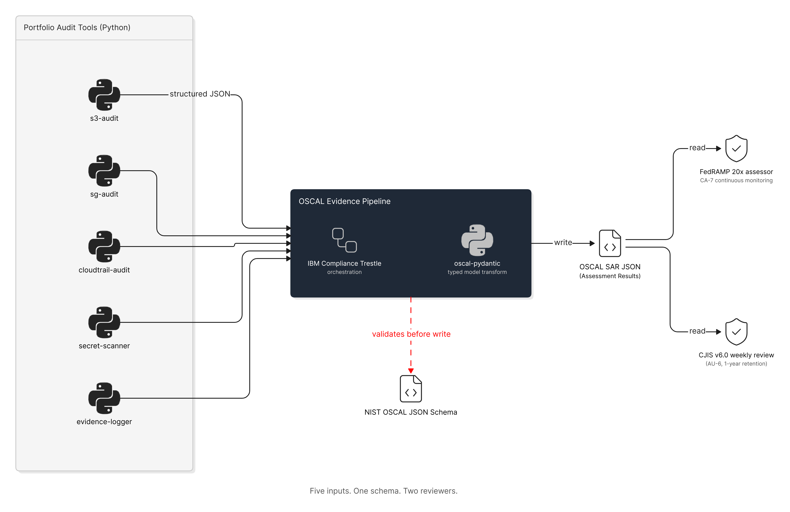

# OSCAL Evidence Pipeline

A Python pipeline that transforms compliance findings from existing audit tools (`s3-audit`, `sg-audit`, `cloudtrail-audit`, `secret-scanner`, `evidence-logger`) into **OSCAL Assessment Results (SAR)** JSON — the machine-readable evidence format required by FedRAMP 20x and increasingly expected by federal assessors reviewing FedRAMP High and CJIS v6.0 authorization packages.

Built on **IBM Compliance Trestle** (orchestration / CLI workflow) and **oscal-pydantic** (typed transformation of audit-tool JSON into OSCAL models).

> **Status:** Phase 1 in development. v1.0 ships SAR generation from existing portfolio audit tools. POA&M (v1.1) and Component Definitions (v1.2) follow.

<picture>
  <source media="(prefers-color-scheme: dark)" srcset="assets/oscal-evidence-pipeline-dark.png">
  
</picture>

## Why This Exists

The compliance audit world is moving from Word/PDF evidence to **machine-readable evidence**. FedRAMP 20x makes OSCAL the canonical format. Once your audit tools emit OSCAL Assessment Results instead of plaintext logs, an assessor — or, more importantly, a continuous-monitoring pipeline — can consume them without manual transcription.

This repo is the **transformation layer** between your operational audit tools and the OSCAL ecosystem. Without it, every audit tool produces a different JSON shape that has to be hand-mapped to an SAR entry. With it, the workflow is:

```
audit tool runs → emits structured JSON → pipeline transforms → OSCAL SAR JSON → assessor / dashboard / Trestle assemble
```

## Compliance Controls Addressed

This pipeline is a meta-tool: it doesn't satisfy access controls directly. It satisfies the **assessment, monitoring, and audit-record-generation** controls that govern *how compliance evidence is produced and preserved*.

| NIST 800-53 Rev 5 | FedRAMP High | CJIS v6.0 | How This Pipeline Validates |
|--------------------|:------------:|:---------:|-------------------|
| CA-2 Control Assessments | Yes | — | Produces the OSCAL SAR artifact that documents each assessment cycle |
| CA-7 Continuous Monitoring | Yes | — | Runs per audit-tool execution; produces a timestamped SAR for each cycle |
| AU-3 Content of Audit Records | Yes | — | Preserves timestamp, source tool, finding type, mapped control IDs in every SAR observation |
| AU-12 Audit Record Generation | Yes | — | Wraps audit-tool outputs into a generated record — Trestle-structural-validated at runtime, and gated against the published NIST OSCAL JSON Schema in CI |
| SI-4 System Monitoring | Yes | — | SAR output feeds continuous monitoring dashboards and KSI metric pipelines |
| CM-3 Configuration Change Control | Yes | — | Every pipeline run produces a versioned, immutable evidence artifact (timestamped filename, deterministic content) |
| CA-2, CA-7, AU-12 | Yes | 1-year retention, weekly review | SAR JSON is the artifact retained for the CJIS AU-6 weekly review |

## How an Auditor Uses This Output

An assessor reviewing a FedRAMP High or CJIS v6.0 authorization package can consume the SAR JSON directly without manual transcription — each runtime SAR passes Trestle's structural model validation, and the canonical sample SAR is checked against the published NIST OSCAL JSON Schema in CI on every pull request (and pushes to `main`). Each SAR `observation` maps one-to-one to an NIST 800-53A assessment objective — for example, an `s3-audit` finding of "BucketX failed encryption check" becomes an OSCAL observation with `relevant-evidence` pointing to the source tool, `subjects` referencing the bucket, and `props` carrying the mapped control IDs (`sc-28`, `sc-28.1`). The assessor's adequacy determination (satisfied / other-than-satisfied) is captured as the OSCAL `finding` object.

Combined with `evidence-logger` for retention and `aws-config-compliance-monitor` for continuous detection, this completes the FedRAMP 20x evidence loop: **detect → transform → retain → review**.

## FedRAMP 20x Alignment

FedRAMP 20x (Pilot launched March 2025, High pilot FY26 Q4) restructures the program around five pillars: compliance-as-code, machine-readable evidence, continuous monitoring, API-driven evidence, and automated scanning. This pipeline targets the **machine-readable evidence** pillar directly:

- **OSCAL output, not Word/PDF**: Every SAR is a JSON document. At runtime each SAR passes Trestle's structural model validation (Layer 2); in CI, the canonical sample SAR is additionally validated against the published NIST OSCAL JSON Schema (Layer 3) on every pull request (and pushes to `main`) — a schema-nonconformant SAR fails CI and blocks merge. The Layer-3 gate enforces JSON structure, required properties, enums, types, and an approximate token regex (not full `date-time`/`uri` format checking). No manual transcription, no version drift between the spreadsheet and the system.
  - See [ARCHITECTURE.md](ARCHITECTURE.md) §11 (Validation Layers & Schema-Pinning Policy) for the three-layer model (oscal-pydantic typed import → Trestle structural → published-schema CI gate) and the `OSCAL_VERSION` schema-pinning policy.
- **Continuous evidence generation**: Each pipeline run emits a timestamped SAR. A FedRAMP 20x reviewer comparing two SARs from different dates can read the delta directly — a KSI metric in flight.
- **API-driven**: The pipeline is a library + CLI. It can be invoked from CI/CD, from a scheduled job, or from an evidence orchestrator (e.g., on every CloudTrail event indicating an audit-tool re-run).
- **30-day vs 90-day review window**: FedRAMP 20x machine-readable packages get a 30-day review SLA versus 90 days for traditional packages. The SAR output is the unit of input to that 30-day review.

## CJIS v6.0 Relevance

CJIS Security Policy v6.0 (published Dec 27, 2024) aligns to NIST 800-53 Rev 5 and phases in rather than switching on a single date: v5.9.5 was the scored audit standard through March 31, 2026 and v6.0 is the default audit baseline from April 1, 2026, with modernized Priority 2-4 controls fully enforceable Oct 1, 2027 (timing varies by state CSA). The most material delta this pipeline supports is **AU-6**: agencies handling CJI must retain audit records for **1 year** and conduct **weekly review** of those records. The SAR JSON produced by this pipeline is the artifact retained for that 1-year window and the input to that weekly review — directly readable by a reviewer without going back to the raw CloudTrail / IAM policy / S3 audit output.

For public-safety SaaS environments (FedRAMP High + CJIS), the same SAR feeds both review tracks. Producing two separate sets of evidence is unnecessary when both frameworks now reference the same control catalog.

## OSCAL Background (Topic Primer)

OSCAL (Open Security Controls Assessment Language) is **a data format, not a framework**. NIST defines seven OSCAL models that together represent the full compliance lifecycle:

| OSCAL Model | What It Represents | Produced By |
|-------------|-------------------|-------------|
| Catalog | The control inventory itself (e.g., NIST 800-53 Rev 5) | NIST publishes; you consume |
| Profile | A selection / tailoring of a catalog (e.g., FedRAMP High baseline) | FedRAMP PMO publishes; you consume |
| Component Definition | What a specific tool, service, or component implements | You author per tool / per AWS service |
| System Security Plan (SSP) | Full system documentation | You author |
| Assessment Plan (SAP) | What the assessor will check, and how | Assessor or you (for self-assessment) |
| **Assessment Results (SAR)** | What was found during the assessment | **This pipeline** |
| Plan of Action and Milestones (POA&M) | Open findings and remediation plan | This pipeline (v1.1) |

This repo's Phase 1 produces SAR. Phase 2 adds POA&M derivation from FAIL findings. Phase 3 adds Component Definition generation from each portfolio audit tool's capability set.

See `ARCHITECTURE.md` for the full pipeline design, library rationale (Trestle + oscal-pydantic), and integration map for each upstream audit tool.

## Requirements

- Python 3.11+
- [`oscal-pydantic`](https://github.com/RS-Credentive/oscal-pydantic) — typed OSCAL models
- [`compliance-trestle`](https://github.com/IBM/compliance-trestle) — OSCAL workflow CLI + assemble/split
- Source audit tools (any subset): `s3-audit`, `sg-audit`, `cloudtrail-audit`, `secret-scanner`, `evidence-logger`

The pinned dependency set lives in `requirements.txt` and `requirements.lock`; see [Development Setup](#development-setup) for how to install them and how the two differ.

## Development Setup

The package scaffold (`oscal_pipeline/`, `tests/`, `examples/`, `requirements.txt`, `requirements.lock`, `pyproject.toml`) is in place. To work on the pipeline locally:

```bash
# Clone and enter the repo
git clone https://github.com/0xBahalaNa/oscal-evidence-pipeline.git
cd oscal-evidence-pipeline

# Create an isolated virtual environment (Python 3.11+)
python3 -m venv .venv
source .venv/bin/activate

# Install exact pinned deps (--no-deps skips the resolver; avoids trestle/pydantic conflict)
pip install --no-deps -r requirements.lock
pip install -e . --no-deps

# Smoke-test that the package imports and exposes a version
python -c "import oscal_pipeline; print(oscal_pipeline.__version__)"

# Run the test suite
pytest
```

The complete pinned dependency tree lives in `requirements.lock` — it's the **CM-3 artifact** for this repo: the exact versions used to produce any given OSCAL SAR, recorded once and version-controlled. `requirements.txt` documents direct-dependency intent; the looser compatible-release pins in `pyproject.toml` define the contract for downstream installers. The three files together separate "what the package needs" from "what we shipped against."

## Branch Protection

`main`'s protection is **codified** in [`scripts/setup-branch-protection.sh`](scripts/setup-branch-protection.sh) and applied as a one-time ops step. Once applied, merging requires both CI checks to pass:

- **`test`** — pytest + the 80% coverage gate + the OSCAL JSON-Schema validation (Layer 3).
- **`lint`** — `mypy` (strict) + `ruff`.

The script also sets merges to **squash-only** with the source branch auto-deleted on merge. Apply (or re-assert) the full protected state with:

```bash
bash scripts/setup-branch-protection.sh
```

The script is idempotent — re-running re-asserts the same configured state. This is what makes the test/validation suite a **merge precondition (NIST 800-53 CM-3)** rather than an advisory run: it configures `enforce_admins: true`, so once applied the gate is non-bypassable — a red check cannot be merged past, including by repository admins.

## Usage

> Phase 1 MVP. CLI surface subject to change before v1.0 tag.

```bash
oscal-pipeline run \
  --input-dir ./audit-outputs/ \
  --output ./evidence/ \
  --profile fedramp-high
```

The pipeline reads each `*.json` file in `--input-dir`, identifies the source tool by schema fingerprint, transforms each finding into an OSCAL `observation` + `finding`, assembles the full SAR via Trestle, and emits an `assessment-results.json` that has passed Trestle's structural model validation (Layer 2). Conformance against the published NIST OSCAL JSON Schema (Layer 3) is enforced in CI on the canonical sample SAR — see [ARCHITECTURE.md](ARCHITECTURE.md) §11.

## Sample Evidence Output

A complete worked example lives in [`examples/`](examples/):

- **Input** — [`examples/sample-secret-scanner-input.json`](examples/sample-secret-scanner-input.json): a `secret-scanner` run that flagged four files.
- **Output** — [`examples/sample-assessment-results.json`](examples/sample-assessment-results.json): the OSCAL SAR the pipeline produced from it — Trestle-structural-validated on generation and gated against the published NIST OSCAL JSON Schema in CI (the canonical sample the Layer-3 test validates).

Regenerate the output from the input at any time:

```bash
oscal-pipeline run --input-dir examples/ --output ./evidence/ --profile fedramp-high
```

> No real credentials appear in the sample. The `secret-scanner` schema records only the **detection regex** (`pattern_matched`), a file path, and a severity — never the matched secret — so the evidence artifact is structurally incapable of leaking a credential.

### Walk-through: one finding, end to end

The scanner found a hardcoded AWS access key. The input finding:

```json
{
  "file_path": "src/config/deploy.tf",
  "line_number": 12,
  "finding_type": "AWS Access Key ID",
  "pattern_matched": "AKIA[0-9A-Z]{16}",
  "severity": "CRITICAL",
  "control_ids": ["IA-5(7)", "SC-12", "SC-28"]
}
```

The pipeline splits it into **two** OSCAL objects: an **observation** (the raw fact that was seen) and a **finding** (the assessor's conclusion). Control mappings live on the *finding*, because mapping a fact to a control is an assessment *decision* — the observation stays reusable raw evidence.

| OSCAL field | Comes from | What it means |
|---|---|---|
| `observation.description` | `finding_type` | What the scanner detected |
| `observation.methods` | constant `["EXAMINE"]` | The NIST 800-53A assessment method a file scan maps to. (`methods` is a free-form OSCAL string; the pipeline populates it with the 800-53A *examine / interview / test* vocabulary — a scan inspects artifacts, so *examine*.) |
| `observation.collected` | `scan_metadata.timestamp` | When the **evidence** was gathered — provenance from the source tool, **not** pipeline run time |
| `observation.props[*]` | finding fields | AU-3 audit-record content: source tool, severity, file, line, detection pattern |
| `observation.subjects[0]` | `file_path` | The assessed subject (`type: software`, `title:` the path) |
| `finding.target.target-id` | `control_ids[0]` → slug | A machine-oriented reference to the 800-53A assessment **objective** the failure implicates (`IA-5(7)` → `ia-5.7_obj`) |
| `finding.props[control-id]` | all `control_ids` | The catalog control IDs the finding maps to (raw form, e.g. `IA-5(7)`) — the human/catalog-facing side of the same decision |
| `finding.target.status.state` | severity | `not-satisfied` for any FAIL/WARN. OSCAL offers only `satisfied` / `not-satisfied`, so a WARN collapses into `not-satisfied` by design |
| `results[0].reviewed-controls` | union of all findings' controls | The controls under assessment **in this result**, in slug form, sorted |

An **INFO** finding ("no secrets detected") produces an observation but **no finding** — there's nothing to conclude, and OSCAL does not require a finding for every observation.

### Why the output is deterministic (CM-3)

Re-run the pipeline on the same input and every observation, finding, and subject UUID reproduces **exactly** — each is a `uuid5` hash of the object's stable identity (an observation or finding keys on `file_path` + line + detection pattern; a subject keys on `file_path` alone), not random. Only the assessment timestamps (`start` / `end` / `last-modified`) and the two timestamp-seeded document UUIDs change between runs. That stability is what makes two SARs from different dates **diffable** — the unit of input to a FedRAMP 20x continuous-monitoring review.

## Future Enhancements

- POA&M generation from FAIL findings (v1.1)
- Component Definition generation per source audit tool (v1.2)
- AI evidence module — emit AI-specific evidence (model lineage, training data audit logs, bias testing results) as OSCAL observations; connects this pipeline to the AI portfolio layer (Project 10 AI Risk Assessment, Project 12 AI Controls Mappings) (v1.3)
- SSP skeleton generation from a Profile + Component Definition set (v2.0)
- KSI metric extraction from cross-run SAR diffs (v2.0)
- S3 archival of SAR JSON with Object Lock for CJIS AU-6 1-year retention
- Extend the published-schema CI gate beyond the canonical sample SAR — validate operator-runtime output and SARs from every source audit tool. *(The Layer-3 published-NIST-schema gate itself is delivered — it runs inside the existing `test.yaml` pytest step on every PR/push.)*

## Framework Reference

Control family mappings and AWS implementation details are documented in [nist-800-53-rev-5-to-aws-mapping](https://github.com/0xBahalaNa/nist-800-53-rev-5-to-aws-mapping).

OSCAL specifications: [pages.nist.gov/OSCAL](https://pages.nist.gov/OSCAL/)

FedRAMP 20x program documentation: [fedramp.gov](https://www.fedramp.gov)

## License

MIT
